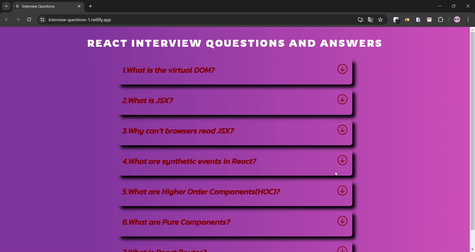

<h1>Interview Questions<h1>



[👉click here to login interview questions](https://interview-questions-1.netlify.app/)

<h2>Project Skeleton</h2>

```
Interview Questions  (folder)
  |          
  |---public (folder)
  |
  |---src (folder)   
  |     |---scss (folder)
  |     |     |---_reset.scss
  |     |     └---_variables.scss
  |     |    
  |     |  
  |     |---helper (folder)
  |     |     |---data.js  
  |     |     └---icons.js 
  |     |  
  |     |---components (folder)
  |     |     |---header (folder)
  |     |     |    |---Header.jsx
  |     |     |    └---header.module.scss
  |     |     |    
  |     |     └---main (folder)
  |     |          |---Main.jsx
  |     |          |---main.module.scss
  |     |          └---Question.jsx
  |     |
  |     |---App.js
  |     |---Index.js
  |     └---Index.scss
  |         
  |----package.json
  |----yarn.lock
  └----readme.md 
```